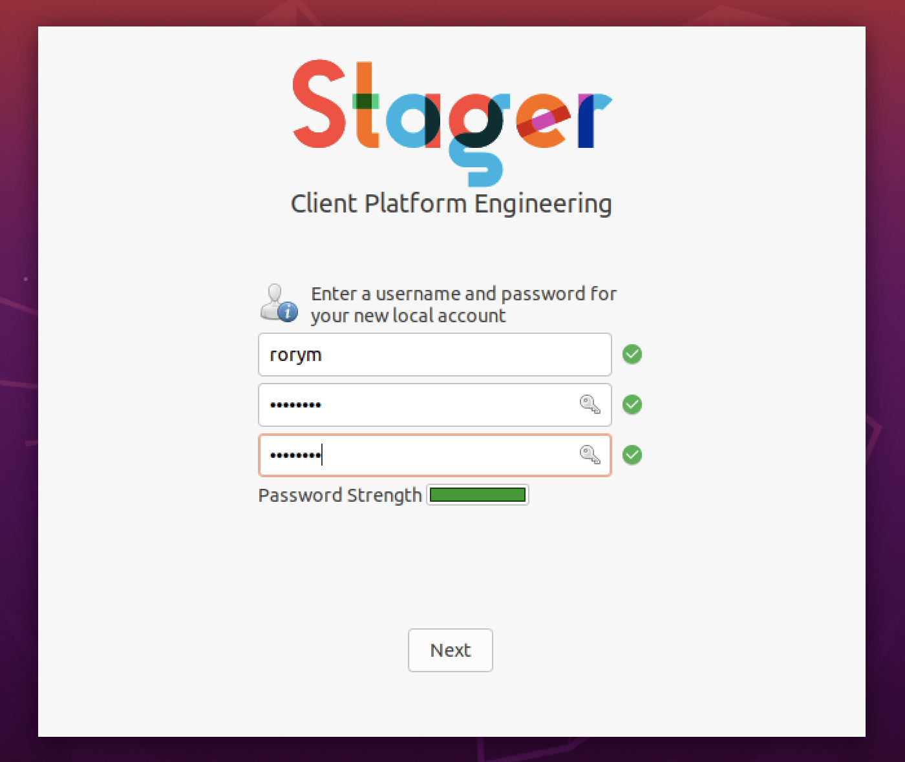
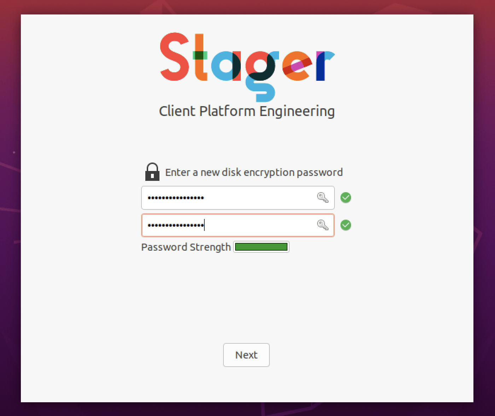

# Stager


Stager is a GTK3 GUI for your Python functions to be used during enrolment.

It's simple, the function it calls must return a `bool` and the row is updated accordingly.

Most of the settings are defaulted but can be easily modified in the `config.json` file.

For more screenshots visit the [experience page](experience.md)

## How to install it

`git clone <stager url>`

`pip -e ./stager`

## How to launch it

`stager`

or optionally with config

`stager --config config.json`

## How to auto launch it

The easiest way is to create a sudoers file and an autolaunch file

- Create a sudoers file that allows it to run as root

`echo "staging    ALL=(ALL:ALL) NOPASSWD: /usr/bin/python3" >> /etc/sudoers.d/cpe-stage`

`chmod 0440 /etc/sudoers.d/cpe-stage`

⚠️ Make sure you remove this file as part of staging or afterwards with your management tools

- Create an application auto launch file

`mkdir -p /home/staging/.config/autostart`

`touch /home/staging/.config/autostart/cpe-stage.desktop`

`chown 1000 /home/staging/.config/autostart/cpe-stage.desktop`

`nano /home/staging/.config/autostart/cpe-stage.desktop`

- Paste in

`cpe-stage.desktop`

```bash
[Desktop Entry]
Type=Application
Exec=sudo /usr/local/bin/stager
Hidden=false
NoDisplay=false
X-GNOME-Autostart-enabled=true
Name[en_US]=CPE Stage
Name=CPE Stage
Comment[en_US]=
Comment=
```

### Disable gnome setup application

`touch /home/staging/.config/gnome-initial-setup-done`

`chown 1000 /home/staging/.config/gnome-initial-setup-done`

## Launch arguments

|Argument|Type|Description|
|-|-|-|
|--debug||Increase logging verbosity|
|--config||Use a custom config file|
|--auto||Automatically advance through the pages|
||||
|Testing only||Only use for testing, not in prod|
|--page|`str`|Open a specific page on launch|
|--username|`str`|Specify a username to be used|
|--password|`str`|Specify a password to be used|
|--cryptkey|`str`|Specify a crypt key to be used|

## Config basic

All you need to get started is a list of python functions to run

```json
{
    "tasks": [
        {
            "os_check": {
                "name": "Check OS version",
                "icon_name": "user-desktop",
                "function": "cpe_stage.utils.os_check()",
                "error_message": "Unfortunately you're not running a supported OS version only Ubuntu 20.04 LTS and higher is supported"
            },
            "check_network_connection": {
                "name": "Check network connectivity",
                "icon_name": "emblem-shared",
                "function": "cpe_stage.utils.check_network_connection()",
                "error_message": "📡 Please check your internet connection"
            }
        }
    ]
}
```

This will run the commands and if they fail stop the process.

## Config advanced

The GUI uses a json config file with the following fields:

||Variable name|Type|Description|Optional|Default value|
|-|-|-|-|-|-|
|Required Fields||||||
||||||||
||tasks|`list`|A list of tasks to run|No||
|||||||
|Tasks||||||
||name|`str`|Name of the task|No||
||icon|`str`|Path to the image icon (16px x px)|No||
||icon_name|`str`|Name of the system icon to use (gtk3-icon-browser)|No||
||function|`str`|The python function to run|No||
||returns|`str`|What the function returns|Yes|`bool`
||hidden|`bool`|Hide the task from the UI|Yes|`False`|
||halt_on_error|`bool`|If this task fails stop staging|Yes|`False`|
||error_message|`str`|The message to display on the failed task window|Yes|`None`|
|||||||
|Optional Fields||||||
|||||||
|UI|Variable name|Type|Description|Optional|Default value|
||app_title|`str`|Title for the application|Yes|`Stager`|
||app_icon|`str`|Filename for the icon for the application from the assets folder|Yes|`app_icon.png`|
||hero_logo|`str`|Filename for the logo to display from the assets folder|Yes|`logo.png`|
||hero_text|`str`|Text under the logo|Yes|`None`|
||always_on_top|`bool`|Keep the window on top of all others|Yes|`True`|
||show_window_buttons|`bool`|Show the window decorations|Yes|`True`|
||progres s_percentage|`bool`|Show a % above the progress bar|Yes|`False`|
||show_hidden|`bool`|Show any hidden tasks|Yes|`False`|
||welcome_emoji|`str`|The jumboji to show on the welcome screen, this will be overridden with an image if provided|Yes|💻
||welcome_image|`str`|An image filename to replace the jumboji|Yes|`None`
||welcome_text|`str`|The text to display at the Welcome screen|Yes|`Welcome to your new computer!\n\nWe've got lots of work to do, click below to get started`
||username_text|`str`|The text to display above the username and password field. If you have the word `email` the placeholder will change to Email address|Yes|`Enter a username and password for your new local account`
||username_icon|`str`|The Gtk icon name to show next to the username text|Yes|`user-info`
||encryption_text|`str`|The text to display above the disk encryption field|Yes|`Enter a new disk encryption password`
||encryption_icon|`str`|The Gtk icon name to show next to the encryption text|Yes|`network-wireless-encrypted`
||finished_text_top|`str`|The text to display above the finished jumboji|Yes|`That was easy!`
||finished_emoji|`str`|The emoji to show on the finished page|Yes|`🎉`
||finished_text_bottom|`str`|The text to display below the finished jumboji|Yes|`We're all done!`
||finished_text_reboot|`str`|The text to show if rebooting|Yes|`We're all done!\n\n This computer will reboot in`|
||finished_text_quit|`str`|Show a splash screen at the end of staging|Yes|`We're all done!`|
||reboot_delay|`int`|How long to wait (sec) until auto reboot (requires reboot_when_done: True)|Yes|`5`|
||logo_height|`int`|How high the logo should be|Yes|`128`|
||logo_width|`int`|How wide the logo should be|Yes|`128`|
||status_inprogress|`str`|The Gtk icon to use for the task in the state|Yes|`gtk.spinner`|
||status_pending|`str`|The Gtk icon to use for the task in the pending state|Yes|`None`|
||status_completed|`str`|The Gtk icon to use for the task in the completed state|Yes|`emblem-default`|
||status_failed|`str`|The Gtk icon to use for the task in the failed state|Yes|`emblem-important`|
||input_valid|`str`|The Gtk icon to use for the validation check pass|Yes|`emblem-important`|
||input_invalid|`str`|The Gtk icon to use for the validation check fail|Yes|`emblem-important`|
|||||||
|Operational|Variable name|Type|Description|Optional|Default value|
||asset_location|`str`|Path where all the assets are stored|Yes|`/root/stager/assets`|
||reboot_when_done|`bool`|Reboot when all tasks are completed|Yes|`True`|
||halt_on_error|`bool`|If any task fails stop staging|Yes|`True`|
||dry_run|`bool`|No tasks are run, `True` response is mocked|Yes|`False`|
||import_modules|`list`|A list of modules to import|Yes|`[]`|
|||||||
|Functional|Variable name|Type|Description|Optional|Default value|
||disallowed_usernames|`list`|A list of usernames you don't want to be accepted by validation|Yes|`["root","admin","test","guest","administrator","user1",""]`|
||password_minimum_length|`int`|The minimum length of a valid password|Yes|`6`|
||password_mixed_case|`bool`|Should the password require mixed case|Yes|`True`|
||password_contains_digit|`bool`|Should the password require a digit|Yes|`True`|
||password_contains_special_character|`bool`|Should the password require special characters|Yes|`True`|
||password_deny_list|`list`|A list of passwords you don't want to be accepted by validation|Yes|`["root","admin","test","guest","Welcome123!","Pa55word!","Password123!",""]`
||crypt_key_minimum_length|`int`|The minimum length of a valid crypt key|Yes|`6`|
||crypt_key_mixed_case|`bool`|Should the password require mixed case|Yes|`True`|
||crypt_key_contains_digit|`bool`|Should the password require a digit|Yes|`True`|
||crypt_key_contains_special_character|`bool`|Should the password require special characters|Yes|`True`|

## Inputs

This tool supports two common inputs.



- Username and password

    If you have any mention of username and/or password in your python function arguments the username / password window will be shown.

    e.g.

    `create_user(username, password)`



- Crypt key

    If you have any mention of crypt_key in your python function arguments the encryption password window will be shown.

    e.g.

    `encrypt_disk(crypt_key)`

## Worth reading

<https://python-gtk-3-tutorial.readthedocs.io/en/latest/introduction.html>

<https://lazka.github.io/pgi-docs/index.html#Gtk-3.0/>

<https://athenajc.gitbooks.io/python-gtk-3-api/content/>

<https://docs.gtk.org/gtk3/>

<https://glade.gnome.org/>
