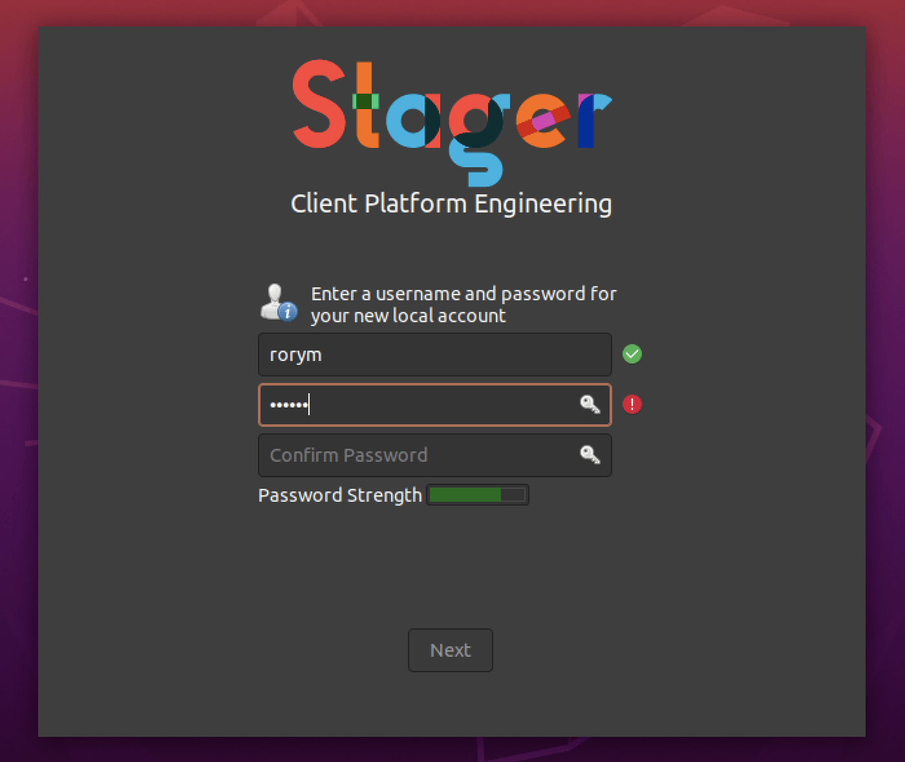
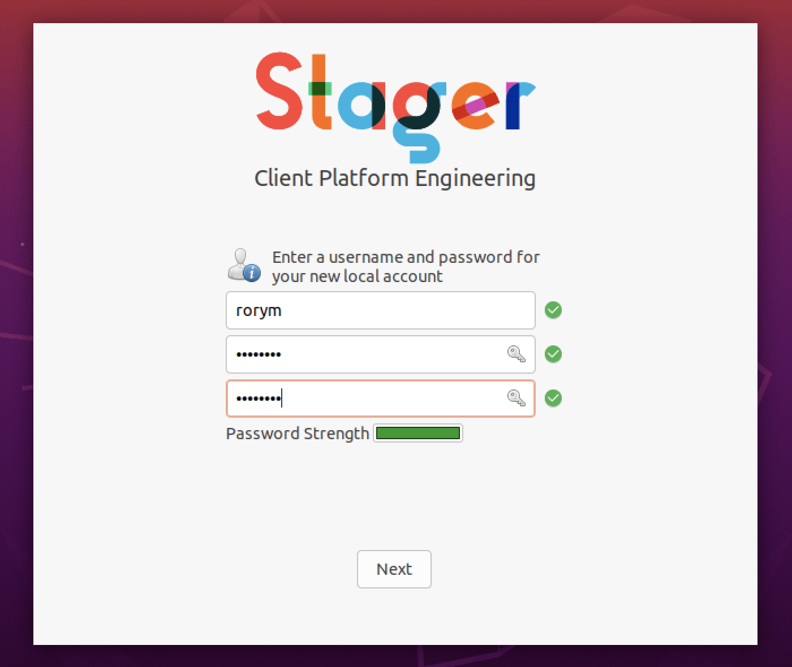

# What a full run looks like

## Landing page

|||
|-|-|
|||

## Request user input

|||
|-|-|
|||
|||
|||

|||
|-|-|
|||
|||

## Staging

|||
|-|-|
|||
|||

## Finished

|||
|-|-|
|||

## UI Customisation

## Hero text

The text under the logo is optional or customisable

|||
|-|-|
|||

## Staging progress

You can have a progress bar %

|||
|-|-|
|||

## Error

|||
|-|-|
|||
